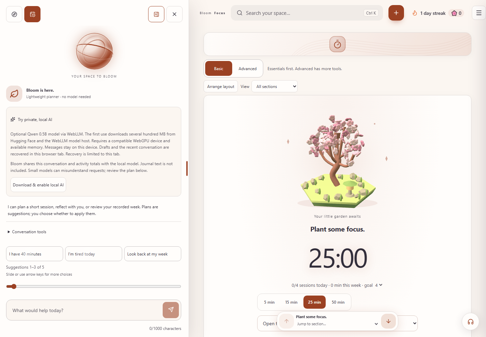
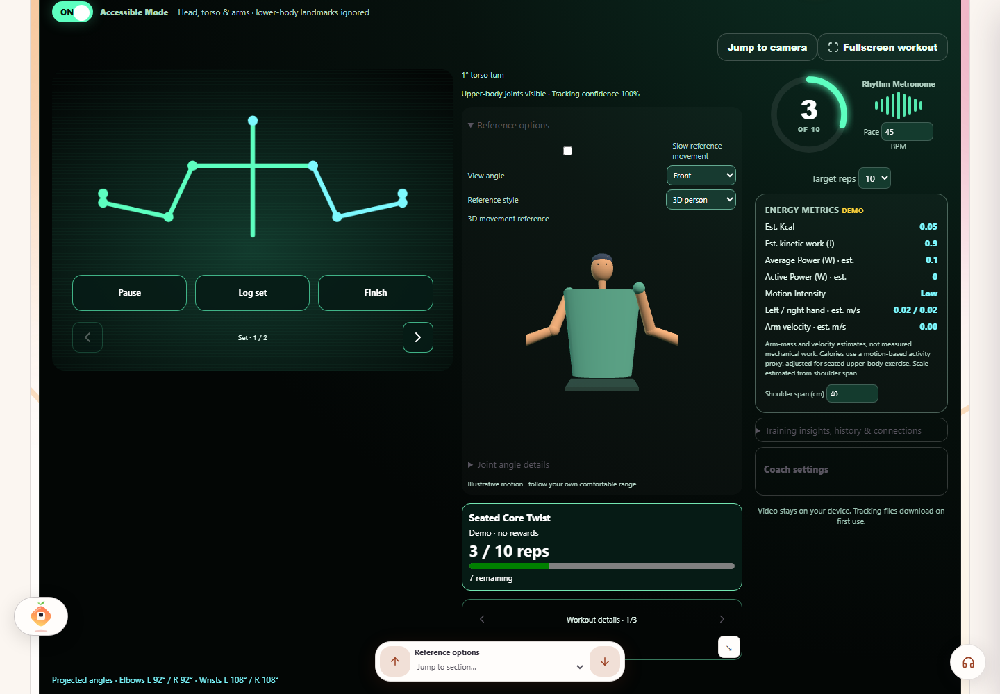
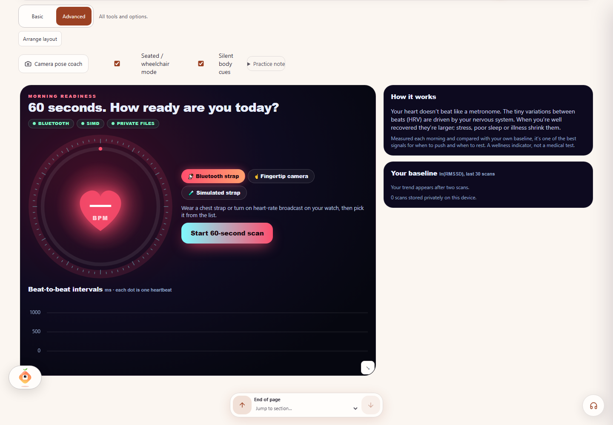
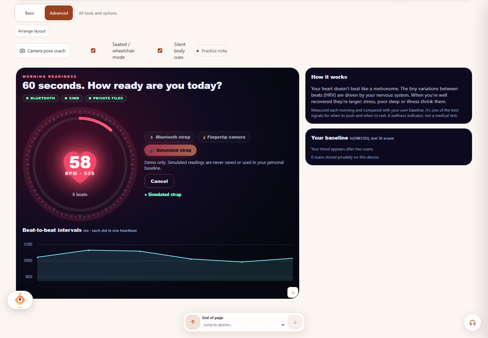
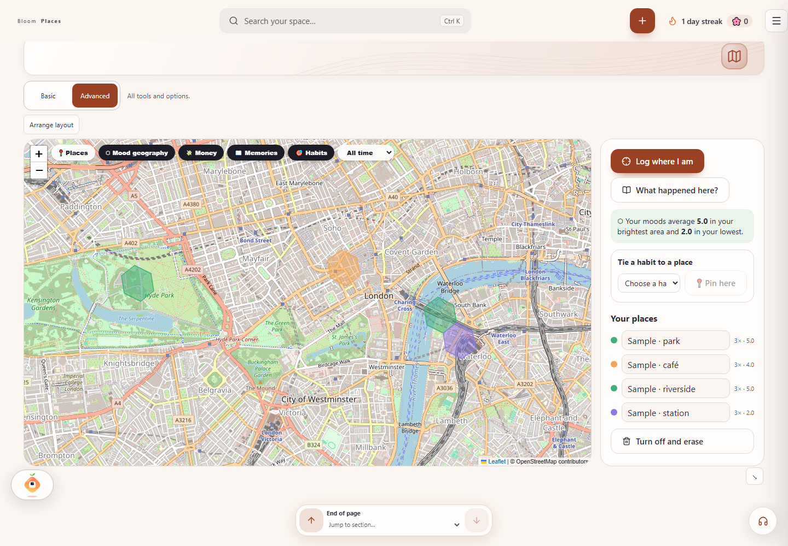
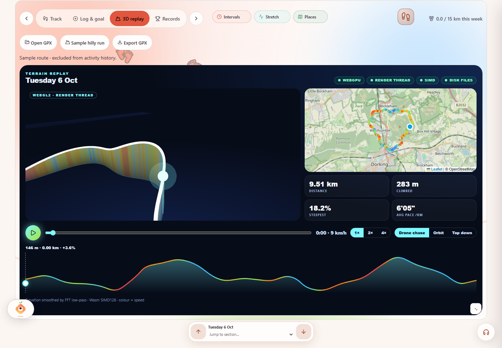
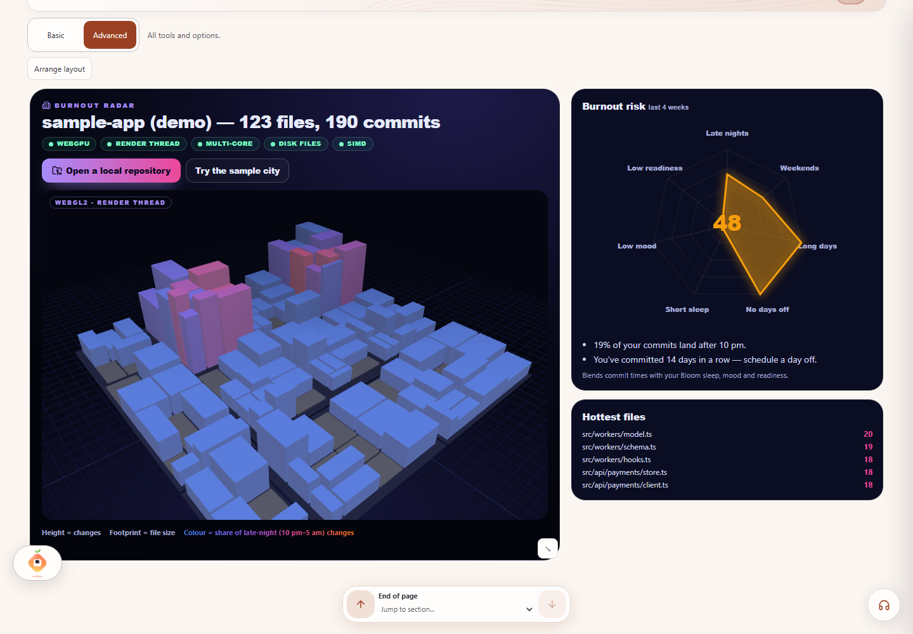
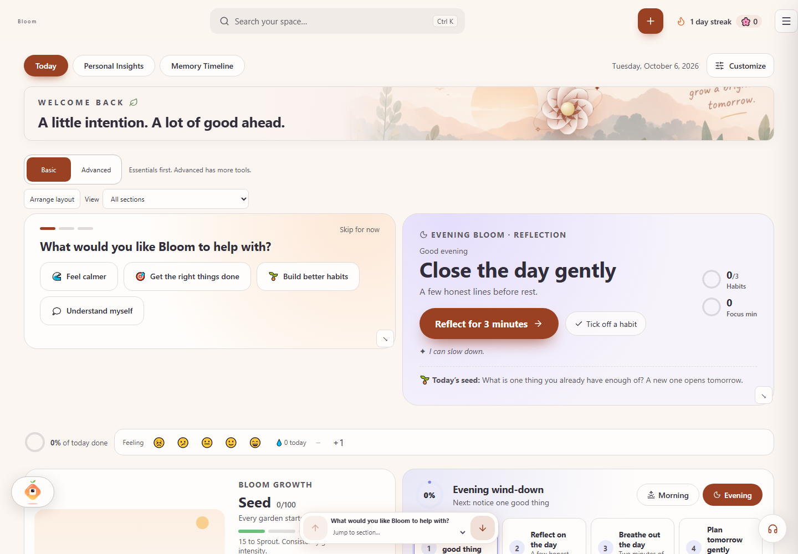
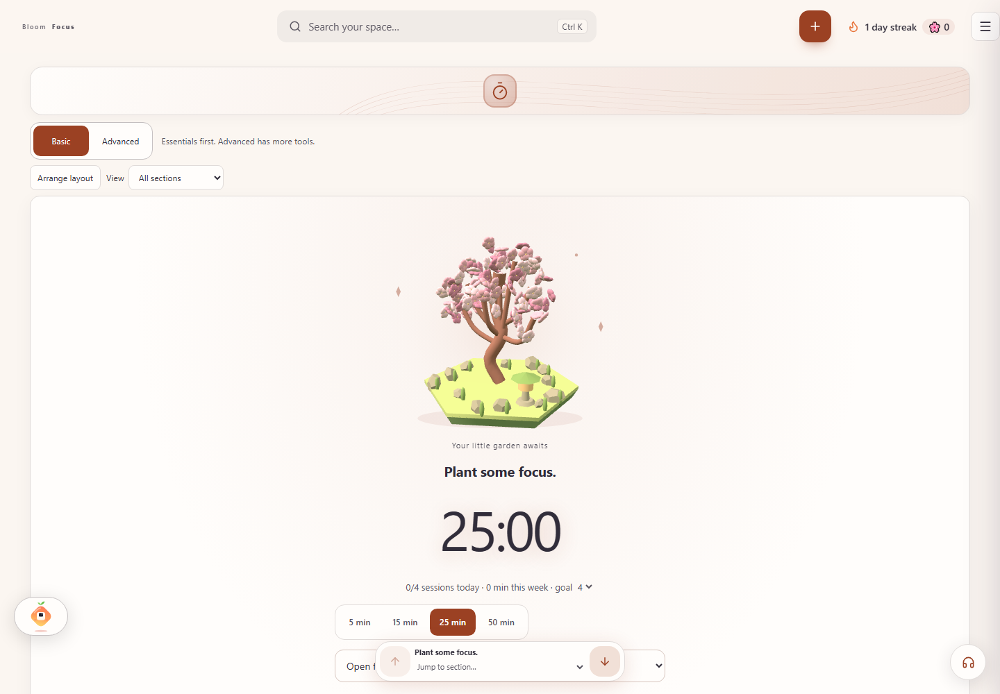

# Bloom — Mindfulness Dashboard

Bloom is a personal React and TypeScript wellness workspace for habits, planning, focus, journaling, money, and learning. It also showcases modern browser technology: local AI, camera-based workouts, Bluetooth sensors, interactive maps, and 3D visualizations.

By default, personal records live in browser storage. Everyday tools work without an account or AI model. Optional features download models or request map tiles; camera, location, Bluetooth, and local folders require your permission.

## Highlights

- Habit tracking, calendar planning, and focus sessions
- Journaling, money, learning, and reflection tools
- Shared themes, cards, and UI motion through Framer Motion and GSAP
- Hidden scrollbar chrome with wheel, touch, keyboard, and section-arrow navigation
- Optional local WebLLM support, MediaPipe workouts, Bluetooth sensors, and maps

## Technology showcase

Fresh screenshots capture the current app at 1440 × 1000. Workout, readiness, terrain, and repository examples use built-in demos. The map contains fictional sample check-ins. The AI image shows setup; the Bluetooth image shows source selection. Neither demonstrates a downloaded model or a paired physical device.

### Private, local AI

Open **Talk to Bloom → Plan with Bloom → Try private, local AI**. A lightweight planner works immediately. Optional Qwen2.5 0.5B inference uses **WebLLM, WebGPU, and a dedicated Web Worker**. The model downloads only after opt-in. Conversation and activity totals are processed locally; journal text is excluded from the model context. Proposed plans remain yours to review and apply.



Source: [local AI engine](src/companion/localAI.ts), [companion interface](src/companion/BloomCompanion.tsx).

### Webcam workouts and Form Coach

Open **Workouts → Advanced → Form coach**, or use `#workouts/coach`. **MediaPipe Pose Landmarker** estimates joints on-device, with GPU tracking and a CPU fallback. Form Coach combines a skeletal overlay, rep counting, calibration, tempo guidance, exercise references, and accessible upper-body practice. Optional hand tracking supports gesture controls.



*Built-in demo athlete, not a live webcam feed. Demo movements are excluded from workout history.* Camera tracking needs HTTPS or localhost and camera permission. Models download on first use; the production app offers explicit offline preparation.

Source: [Form Coach](src/features/workout/FormCoach.tsx), [offline setup](src/features/workout/coachOffline.ts).

### Bluetooth heart-rate sensors

Open **Morning readiness**, or use `#readiness`. **Web Bluetooth** reads the standard GATT Heart Rate service, including beat-to-beat intervals when the device supplies them. Bloom also supports fingertip camera input and a simulator. Real scans are compared with your own recorded baseline.

| Bluetooth source selection | Live simulator preview |
|---|---|
|  |  |

*No physical sensor was paired for these captures. Simulated scans never enter personal baselines.* Pairing requires a browser exposing Web Bluetooth and a compatible device broadcasting the Heart Rate service. Form Coach also supports silent wearable alerts; vibration needs a companion exposing the documented writable characteristic.

Source: [sensor sources](src/features/readiness/sources.ts), [wearable connections](src/features/workout/CoachWearables.tsx).

### Your life, on a map

Open **Places**, or use `#places`. **Leaflet, OpenStreetMap, browser geolocation, and H3 hexagons** connect places with moods, memories, spending, and location-based habits. Location recording is opt-in. Viewed map tiles can be cached for offline access; uncached areas need a connection.



*Fictional sample check-ins in an isolated browser context. OpenStreetMap supplies the basemap; personal location records remain in browser storage.*

Source: [Places map](src/features/places/PlacesPage.tsx), [location store](src/features/places/placesStore.ts).

### 3D terrain replay

Open **Run & walk → Advanced → 3D replay**, or use `#run/terrain`. Import a GPX track or try **Sample hilly run**. **Three.js**, a speed-colored map, and an elevation profile show the same journey. Supported browsers render scenes on an **OffscreenCanvas worker**, with a main-thread fallback.



*Built-in sample route, excluded from activity history.*

Source: [terrain replay](src/features/run/TerrainReplay.tsx), [rendering runtime](src/platform/offscreen.ts).

### Code City

Open **Code City**, or use `#code-city`. **File System Access, isomorphic-git, workers, and Three.js** turn a repository into a city: height reflects changes, footprint reflects file size, and color reflects late-night activity. The page also visualizes development rhythm. Folder access is read-only and user-selected.



*Built-in sample repository; no personal repository was opened.*

Source: [Code City](src/features/codecity/CodeCityPage.tsx), [Git reader](src/features/codecity/gitReader.ts).

## Everyday workspace

| Dashboard | Focus |
|---|---|
|  |  |

Long pages share up/down arrows and a section menu. Wheel, touch, and keyboard scrolling remain available. Motion respects reduced-motion preferences.

The focus garden combines a Three.js blossom tree, GSAP growth transitions, and SVG artwork with a fallback for devices without WebGL. Petals drift and branches sway while a session grows; animation pauses offscreen and follows motion settings. Bloom chat uses the app theme by default, shares common button styles, and leaves section arrows clear of its panel.

Garden design references: [Focus Tree blossom garden](https://www.pinterest.com/pin/690176711698423403/) and [K Bank Money Tree motion study](https://www.behance.net/gallery/207011093/K-Bank-Money-Tree-Grow-Your-Wealth). All garden geometry and SVG artwork are generated locally.

## Development

```powershell
npm.cmd ci
npm.cmd run dev
npm.cmd test
npx.cmd playwright install chromium
npm.cmd run test:e2e
npm.cmd run lint
npm.cmd run build
npm.cmd run preview
```

Typical project layout:

- `src/`: app logic, features, views, and styling
- `tests/`: unit and persistence tests
- `e2e/`: Playwright end-to-end checks
- `docs/`: feature docs and screenshots

### Refresh the showcase screenshots

With the dev server running:

```powershell
node scripts/technology-screenshots.mjs
```

Set `BLOOM_URL` to capture another local preview. Pass a screenshot name, such as `local-ai`, to refresh one image. The script uses disposable browser contexts, built-in demos, and fictional map data. It does not download the AI model, start a real camera, pair hardware, or open personal repositories. Captures and route/caption metadata are saved in [the screenshot manifest](docs/screenshots/technology/manifest.json).

## Open-source libraries and browser capabilities

| Library / platform | Purpose |
|---|---|
| React / React DOM | UI framework |
| TypeScript | Type safety |
| Framer Motion | Motion and transitions |
| Formik | Form handling |
| FullCalendar | Calendar and scheduling |
| @react-three/fiber + drei | 3D scenes and interaction |
| Nivo | Charts and data visualization |
| Tiptap | Rich text editing |
| Radix UI | Accessible menus, popovers, selects |
| @mlc-ai/web-llm | Optional local AI model support |
| @mediapipe/tasks-vision | On-device pose and hand tracking |
| Leaflet / react-leaflet / H3 | Interactive maps and mood geography |
| Three.js / OffscreenCanvas | Terrain and repository scenes with rendering fallbacks |
| isomorphic-git / File System Access | Read-only local repository analysis |
| Web Bluetooth | Heart-rate notifications and compatible wearable companions |
| WebAssembly / workers / OPFS | DSP, background computation, and local media storage |
| GSAP | Shared UI reveals and scene animation |
| CodeMirror | Code editing and review experiences |
| DnD Kit | Drag-and-drop interactions |
| @react-pdf/renderer | PDF generation |
| @fontsource/* | App typography |

Capabilities vary by browser and device. Feature pages display capability badges and provide demos or fallbacks where implemented. Technology pages may need **Advanced** mode to reveal their full tab sets.
