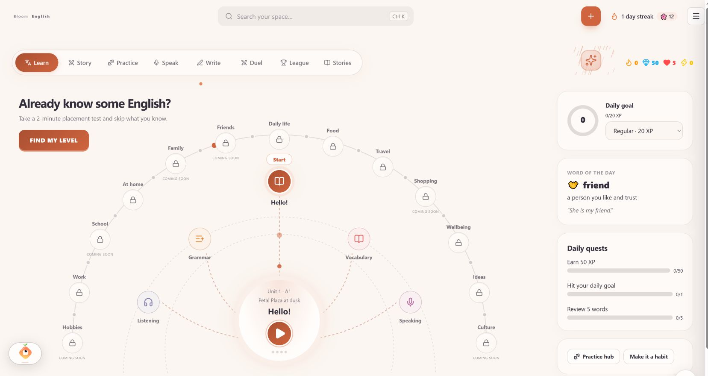
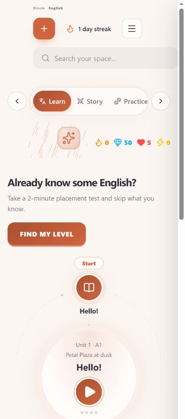
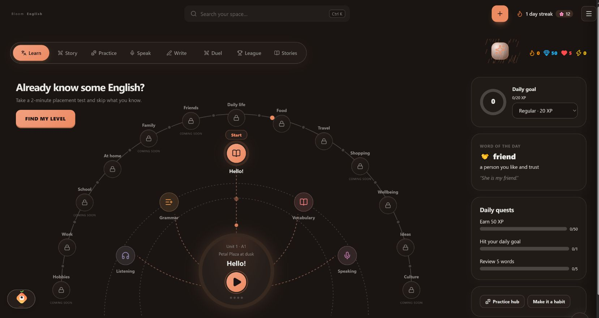

# English learning map refresh

The Learn page now uses a circular SVG learning map inspired by the supplied mockup. Lessons, placement, daily goals, quests and practice remain connected to the existing learner data. Completed units can be revisited through the course selector. Future topics explicitly say Coming soon; locked course topics explain their prerequisite.

The map, controls and cards use Bloom theme tokens. Decorative SVG motion respects the system and Bloom reduced-motion preferences. At phone widths the map becomes a lesson card, practice shortcuts and topic rows.

Validation: TypeScript, focused ESLint, two progress/locking regression tests, and production build passed. Browser checks covered lesson launch, placement launch, light/dark themes, and desktop (1672px), tablet (768px) and phone (390px) widths without document overflow. Existing third-party bundler warnings remain.

